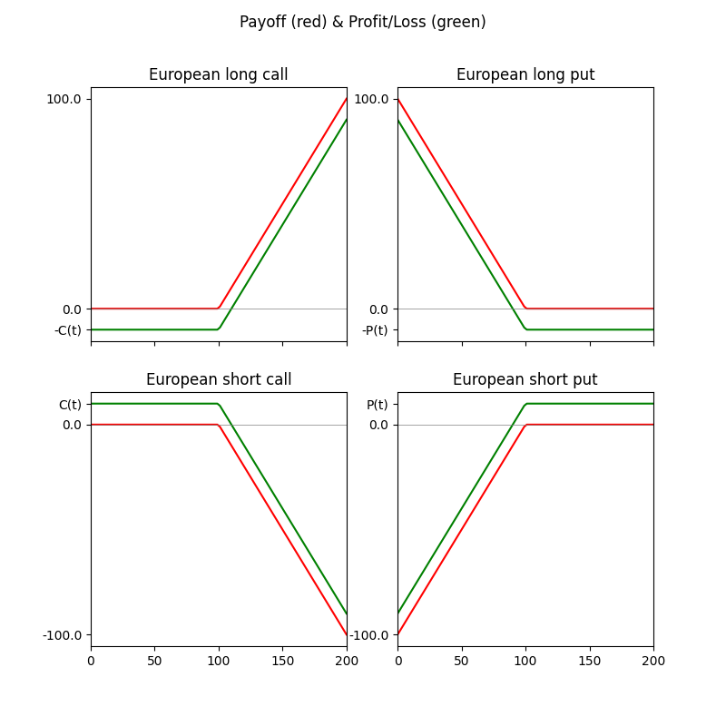

# The Art of Quantitative Finance Vol.1

Volume 1 is the first of a 3 volumne series including:

1. Trading, Derivatives and Basic Concepts
2. Volatilities, Stochastic Analysis and Valuation Tools
3. Risk, Optimal Portfolios and Case Studies

Volume 1 contains 3 chapters. The first one is more like an introduction. So we start directly from chapter 2

The book is kind of informal, so notes will be just listed as bullets

## Chapter 2. Derivatives and Trading in Derivatives, Basic Concepts and Strategies

### 2.1. What Is a Derivative?

- A derivative (financial product) is a financial product that derives its value from another financial product.
- The financial product A from which a particular derivative D is derived is referred to as the “underlying asset” of D.

### 2.2. European Plain-Vanilla Options, Definition and Basic Characteristics

- “Plain-vanilla” options are standard options with no special features.
- Options can be [for this book]: call & put, american & european, and have long & short positions.
- **Long position** or going long: *buy*, because we have to pay a premium.
- **Short position** or going short: *sell*, because we receive payment of a premium

> The holder of a long/short position in a **European** call/put option on the underlying asset A with expiration date T and strike price K receives/pays a **Payoff** at time T. Since that holder initially purchased/selled the option at the price $C(t_0)/P(t_0)$, the profit (loss) from the option position is **Profit**

| Position\Type | European Call | European Put |
| :------------ | ---- | --- |
| Long          | Payoff = $\max(S(T)−K, 0)$   Profit = $\max(S(T) − K, 0) − C(t_0)$ | Payoff = $\max(K-S(T), 0)$   Profit = $\max(K-S(T), 0) − P(t_0)$ |
| Short         | Payoff = $-\max(S(T)−K, 0)$   Profit = $-\max(S(T) − K, 0) + C(t_0)$ | Payoff = $-\max(K-S(T), 0)$   Profit = $-\max(K-S(T), 0) + P(t_0)$ |

- **OTM** (out of the money): no significant payoff (payoff = 0) when exercised immediately
- **ATM** (at the money): payoff ≈ 0 (St ≈ K)
- **ITM** (in the money): significant payoff (payoff >> 0) when exercised immediately

### 2.3. American Options

- American option: option to exercise at any point (only once) until expiration T

> The holder of a long/short position in a **American** call/put option on the underlying asset A with expiration date T and strike price K receives/pays a **Payoff** at any chosen time $t_1 \le T$. Since that holder initially purchased/selled the option at the price $C(t_0)/P(t_0)$, the profit (loss) from the option position is **Profit**

| Position\Type | American Call | American Put |
| :------------ | ---- | --- |
| Long          | Payoff = $\max(S(t_1)−K, 0)$   Profit = $\max(S(t_1) − K, 0) − C(t_0)$ | Payoff = $\max(K-S(t_1), 0)$   Profit = $\max(K-S(t_1), 0) − P(t_0)$ |
| Short         | Payoff = $-\max(S(t_1)−K, 0)$   Profit = $-\max(S(t_1) − K, 0) + C(t_0)$ | Payoff = $-\max(K-S(t_1), 0)$   Profit = $-\max(K-S(t_1), 0) + P(t_0)$ |

### 2.4. Any Strategy Is Better than No Strategy and “The Secretary Problem”

- The idea of this section is to *show* that having a strategy is better than not having one. The games presentend are not usefull later

#### Simple game with 2 players and $n$ options (professional version, aka 'The Secretary Problem'):
- Player A writes $n$ different numbers ($Z_1, ..., Z_n$) in $n$ notes. The notes are shuffled
- Note 1 is uncovered and Player B decides whether or not to take Note 1
- If not, Note 2 is uncovered and Player B decides whether or not to take Note 2, etc
- If not, Note $n-1$ is uncovered and Player B decides whether or not to take Note $n-1$
- If not, Player B gets Note $n$
- Player A gets remaining notes
- **Winner** is the player who has the note with the largest number
- This game is usually illustrated as: An office manager is urgently looking for **one** new secretary. There are **n candidates** outside, waiting to be interviewed for this job. The office manager is in such a hurry that she does not actually intend to interview all *n* applicants. Hence, she starts briefly interviwing one candidate after another (in random order) and decides immediatly after each interview for or against that candidate.
- The best strategy is to discard $m \in [0,n[$ notes and then pick the note with greater number than the previous ones, where
$$m = \arg\max{\sum_{k=m+1}^{n} \frac{1}{n} \frac{m}{k-1}} ,$$
$\frac{1}{n}$ is the probability that the *k-th* note has the largest value, and $\frac{m}{k-1}$ the probability that the first *m* (discarded) notes have greater values than the first *k-1* notes.
- [Adapted proof:] Note that
$$\sum_{k=m+1}^{n} \frac{1}{n} \frac{m}{k-1} = \frac{m}{n} \sum_{k=m+1}^{n} \frac{1}{k-1} = \frac{m}{n} \sum_{k=m+1}^{n} \frac{n}{k-1} \frac{1}{n} = \frac{m}{n} \sum_{k=m+1}^{n} \frac{1}{(k-1)/n} (\frac{k+1}{n} - \frac{k}{n}) .$$
For $n \to \infty$, and writing $x$ as the limit of $\frac{m}{n}$ then $m \to \arg\max{ x \int_{x}^{1} \frac{1}{t} dt} = \arg\max{(- x \ln(x))}$ (by Riemann approximation). Taking the first derivative, $x = 1/e$ and $m = n/e \approx 0.3679 n$
- Meaning that, for $n \to \infty$, we discard the first $m = n/e$ notes and then choose the first note with greater number. Chance of winning = $1/e$

####  Same game as before but $n = 3$ (advanced version):
- Strategy "always choose the first note" or "last note" then chance of winning = 1/3
- Strategy $m=1$ maximizes chance of winning: "Discard $Z_1$. If $Z_2 > Z_1$ then choose $Z_2$, else choose $Z_3$" then chance of winning = 1/2
  * If $Z_1$ largest, lose (1/3)
  * If $Z_2$ largest, win (1/3)
  * If $Z_3$ largest and $Z_1 > Z_2$, win (1/6)
  * If $Z_3$ largest and $Z_2 > Z_1$, lose (1/6)

#### Same game as before but $n = 2$ (simple version):
- Strategy "always choose the first note" then chance of winning = 50%
- Strategy "choose alternately the first and then the second note" then chance of winning = 50%
- Strategy "If the $Z_1 > X$ then pick Note 1, otherwise choose Note 2" then chance of winning > 50%
  * Case 1: $Z_1 < Z_2 \le X$, pick Note 2 & win
  * Case 2: $Z_2 < Z_1 \le X$, pick Note 2 & lose
  * Case 3: $X < Z_1 < Z_2$, pick Note 1 & lose
  * Case 4: $X < Z_2 < Z_1$, pick Note 1 & win
  * Case 5: $Z_1 \le X < Z_2$, pick Note 2 & win
  * Case 6: $Z_2 \le X < Z_1$, pick Note 1 & win
  * Chance of winning: Case 1 & 2, 50%; Case 3 & 4, 50%; Case 5 & 6, 100%; Overall > 50% (for any $X$)

### 2.5. How Do You Trade Options? Trading Through a Bank
- Author focus on options on the S&P 500 index traded in options exchanges
- Prices of options on exchanges (which can be long or short positions) are created through supply and demand
- Trades can be executed by orders to a broker, or placed directly via an electronic platform
- When you trade through a broker:
  * You open a securities account
  * You state that you have experience trading derivatives
  * place orders with the broker at that bank
- Make sure you work with a bank whose tranding desk (brokerage service hours) is open during the hours your target market operates
- Realiable real-time market data can be cost-intensive (Bloomberg, Reuters). Your broker can provide specific real-time information upon request. A free (not always complete) source is [BigChart](https://bigcharts.marketwatch.com/quickchart/options.asp?sid=3377&symb=SPX)
- Consider a put option on the S&P500 with expiration date 18 october 2019, strike price 2950 and bid / ask prices = 39.10 / 40.20
  * Bid price of 39.10 means that we could currently go short (take a short position) on this option at a guaranteed price of 39.10
  * Ask price of 40.20 means that we could currently go long (take a long position) on this option at a guaranteed price of 40.20
  * In author's experience, the trade can occur close to midpoint (39.65). Order to sell (short) highly likely to occur at price 39.50. Order to buy (long), highly likely to occur at price 39.80.
  * The limit order would look like: *Sell to open a put contract on SPX, expiration October 2019, strike 2950, limit 39.50 dollars*, and *Buy to open a put contract on SPX, expiration Octobre 2019, strike 2950, limit 39.80 dollars*
- [Added notes:] You can **buy** or **sell** options, which can be **to open** or **to close**. These can be **market** orders, **limit** orders, and **stop** orders
  * Buy-to-Open (BTO): Long position on a new option
  * Sell-to-Open (STO): Short position on a new option
  * Buy-to-Close (BTC): Long position on an existing option (to close a short position)
  * Sell-to-Close (STC): Short position on an existing option (to close a long position)
  * Market order: buy/sell at the market's current best available price (ensure execution)
  * Limit order: buy/sell with a restriction on the maximum/minimum price to paid/receive
  * Stop order: buy/sell when the price reaches a pre-set price above/below the current market price
- S&P500 options cannot be purchased or sold piecewise, but only in the form of contracts, which covers 100 units of the options

### 2.6. How Do You Trade Options? Trading Through an Electronic Trading Platform
