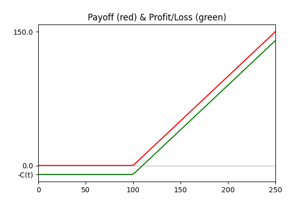
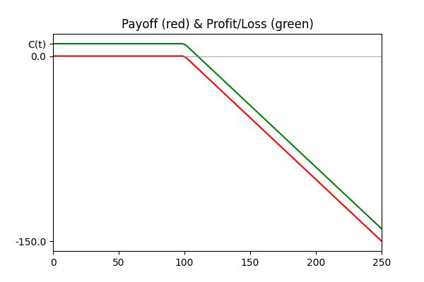
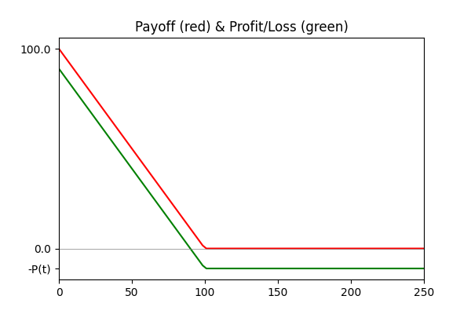
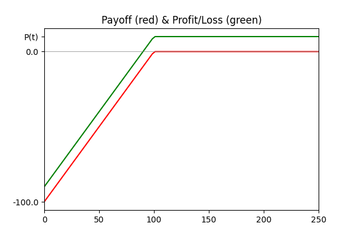

# The Art of Quantitative Finance Vol.1

Volume 1 is the first of a 3 volumne series including:

1. Trading, Derivatives and Basic Concepts
2. Volatilities, Stochastic Analysis and Valuation Tools
3. Risk, Optimal Portfolios and Case Studies

Volume 1 contains 3 chapters. The first one is more like an introduction. So we start directly from chapter 2

The book is kind of informal, so notes will be just listed as bullets

## Chapter 2. Derivatives and Trading in Derivatives, Basic Concepts and Strategies

### 2.1. What Is a Derivative?

- A derivative (financial product) is a financial product that derives its value from another financial product.
- The financial product A from which a particular derivative D is derived is referred to as the “underlying asset” of D.

### 2.2. European Plain-Vanilla Options, Definition and Basic Characteristics

- “Plain-vanilla” options are standard options with no special features.
- Options can be (*for this book*): call & put, american & european, and have long & short positions.
- **Long position** or going long: *buy*, because we have to pay a premium.
- **Short position** or going short: *sell*, because we receive payment of a premium
- **OTM** (out of the money): no significant payoff (payoff = 0) when exercised immediately
- **ATM** (at the money): payoff ≈ 0 (St ≈ K)
- **ITM** (in the money): significant payoff (payoff >> 0) when exercised immediately

#### Long European call

> The holder of a **long position in a European call option** on the underlying asset A with expiration date T and strike price K receives payment of a **payoff** at time T of **max(S(T) − K, 0)**. Since that holder initially purchased the option at the price C(t), the **profit (loss) from the option position is max(S(T) − K, 0) − C(t)**

#### Short European call

> The holder of a **short position in a European call option** on the underlying asset A with expiration date T and strike price K has to pay out a **payoff** at time T of **max(S(T) − K, 0)**. Since that holder initially was paid the option price C(t), the **profit (loss) from the option position is -max(S(T) − K, 0) + C(t)**

#### Long European put

> The holder of a **long position in a European put option** on the underlying asset A with expiration date T and strike price K receives payment of a **payoff** at time T of **max(K - S(T), 0)**. Since that holder initially purchased the option at the price P(t), the **profit (loss) from the option position is max(K - S(T), 0) − P(t)**

#### Short European put

> The holder of a **short position in a European put option** on the underlying asset A with expiration date T and strike price K has to pay out a **payoff** at time T of **max(K - S(T), 0)**. Since that holder initially was paid the option price P(t), the **profit (loss) from the option position is -max(K - S(T), 0) + P(t)**

### 2.3. American Options

- American option: option to exercise at any point (only once) until expiration T

#### Long American call

> The holder of a **long position in a American call option** on the underlying asset A with expiration date T and strike price K receives payment of a **payoff** once at any chosen time t of **max(S(t) − K, 0)**

#### Short American call

> The holder of a **short position in a American call option** on the underlying asset A with expiration date T and strike price K has to pay out a **payoff** once at any chosen time t of **max(S(t) − K, 0)**

#### Long American put

> The holder of a **long position in a American put option** on the underlying asset A with expiration date T and strike price K receives payment of a **payoff** once at any chosen time t of **max(K - S(t), 0)**

#### Short American put

> The holder of a **short position in a American put option** on the underlying asset A with expiration date T and strike price K has to pay out a **payoff** once at any chosen time t of **max (K - S(t), 0)**

